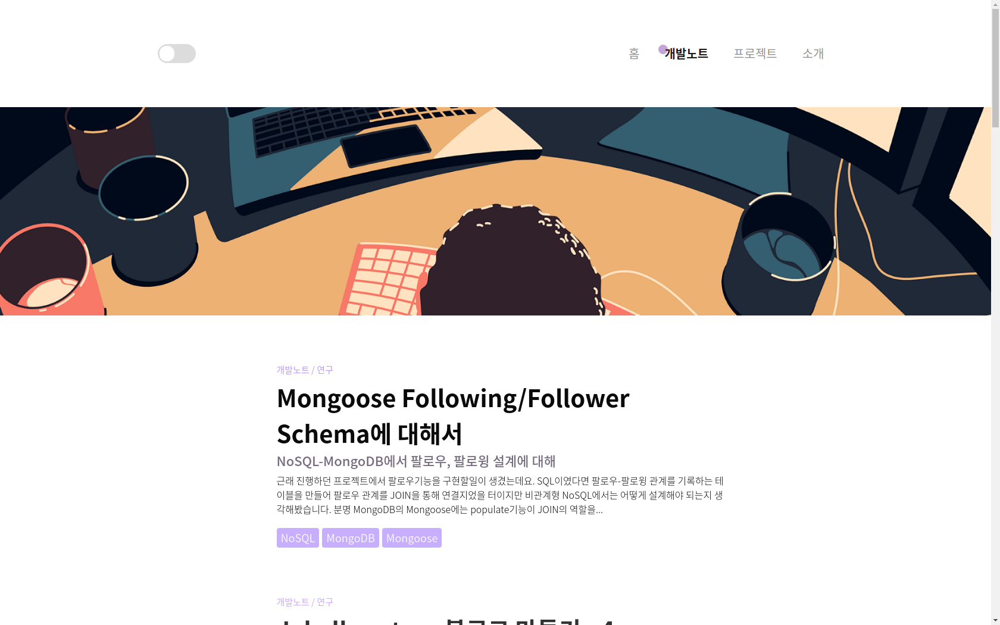
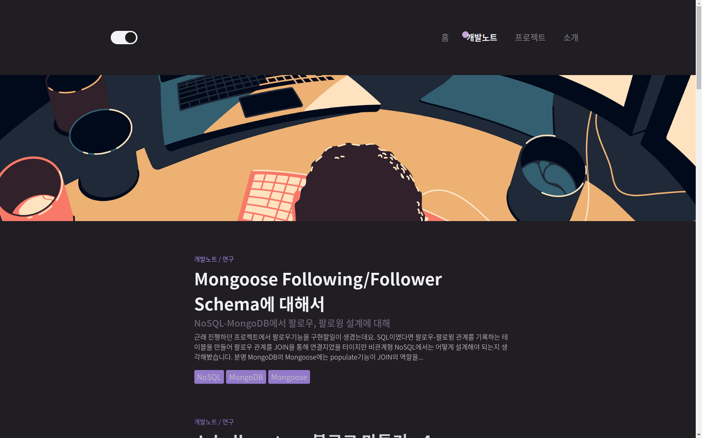
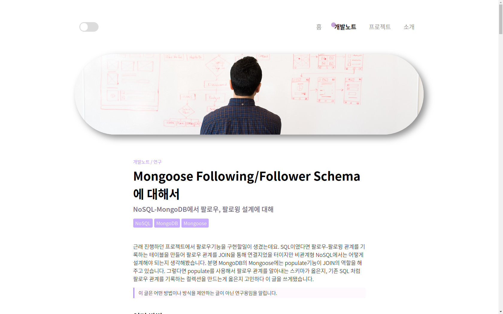
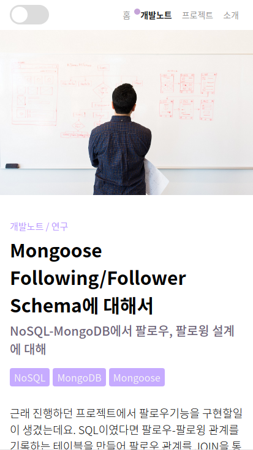

#  kyechan99.github.io

  
 
 
 
## EXAMPLE
### Main

### Darkmode

### Post

### Responsive

## How to customize?
### Customize color
Move to [_variables](https://github.com/kyechan99/kyechan99.github.io/blob/master/_sass/jebl/_variables.scss), and change colors what you want to use.

> Some good to use example themes [THEME](https://github.com/kyechan99/kyechan99.github.io/labels/theme/)

### Customize base (reboot)
Move to [_base](https://github.com/kyechan99/kyechan99.github.io/blob/master/_sass/jebl/_base.scss). Customize what you want. 

### Change about page data
The app in [about.html](https://github.com/kyechan99/kyechan99.github.io/blob/master/_layouts/about.html).

The page data is determined by the data in Vue.js.

## Logic
### Post head-img
Post head-img was point to `/assets/head-img`. ([/head-img](https://github.com/kyechan99/kyechan99.github.io/tree/master/assets/img/head-img))

So you should saved the image here, what you want to show post head image.

## Yuristrap
This project was created using [yuristrap](https://github.com/yuristrap/yuristrap).

